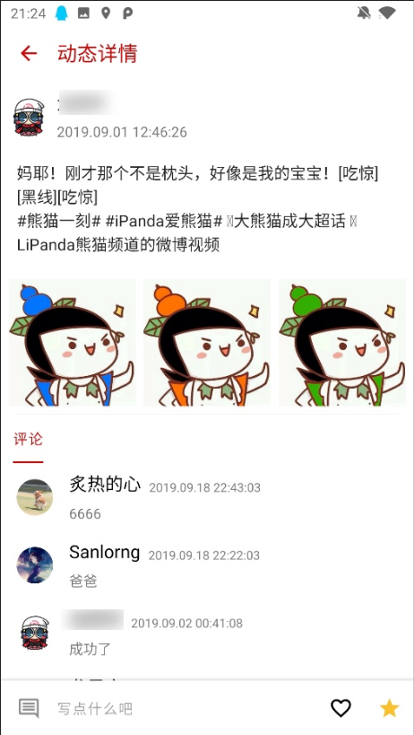

# 大创项目的 Android 端源代码
本项目为本人在大创项目中编写的 Android 端部分代码，本项目已获软著，借鉴请说明源处。
# 项目简介
大学生志愿服务智能信息平台为用户提供便利的服务，用户可通过智能手机或个人电脑随时随地访问网站，了解实时最新的志愿服务信息，可与其他用户畅通无阻的沟通交流。网站结合用户地理位置以及个人偏好为用户推荐适合于用户的志愿服务项目，用户可以通过这个平台了解更多关于志愿服务的信息，也可以交到更多志同道合的朋友。
# 开发环境
在Windows下使用Android Studio 3.5进行开发，使用Android 9手机进行软件测试。
# 功能
## 注册登录功能：
注册登录功能是整个志愿服务平台的前置功能需求，注册登陆成功后根据用户的用户名获取用户id，使用用户id和token管理后续的数据，例如用户信息，用户头像，用户评论，用户发布内容等。
其中还有注册校验，例如：密码过短的提示、手机格式的校验、登陆密码错误提示。需要将具体错误反馈给用户，提升用户交互性。在注册成功后，用户需填写个人身份信息才能进入应用主页面。

## APP主界面功能：
在登陆成功后，进入主界面，主界面底部有4大Tab，分别是首页，消息，动态，个人，如果用户身份是老师还会在底部Tab中间加入一个项目发布的 Button。
## 首页浏览：
在首页放置地区相关的项目，另外可供用户选择地区，顶部放有轮播图banner，能显示该地区的志愿者人数，具有一个项目搜索的搜索框入口，具有推荐项目等的入口。
## 消息页面：
拥有一个全局的聊天室，以及显示在线人数，能够及时显示别人向用户发送的消息，用户可以在这个页面向其他用户发送消息，具有聊天匹配模式。
## 聊天匹配功能：
向服务器发出匹配用户的请求，匹配到用户id后，进入单聊界面进行聊天。
## 聊天功能：
通过 Websocket 向服务器发出请求，同步聊天数据，用户在这个窗口可以单独和其他用户聊天，发送失败会有相关提醒。
## 项目发布功能：
老师可以发布一个志愿服务项目，Android端将相关项目信息及用户信息发送到服务器，服务器生成数据后返回结果，若发布成功，则进入项目详情页面，发布失败则会有相关提醒。
## 获取项目详情功能：
根据项目id 向服务器获取项目详情信息，并正确加载到项目详情页，项目具有文本，图片，视频等信息，同时提供项目编辑，项目删除，项目加入，项目收藏等的入口。
## 上传视频和图片功能：
向服务器传输本地图片/本地视频的文件流，给项目增添宣传图片和视频。
## 项目编辑功能：
提供修改项目的文本信息的功能，将修改后的数据发送到服务器，修改成功后刷新项目详情页面。
## 项目删除功能：
提供删除项目的功能，删除前需用户进行二次确认。
## 项目加入功能：
对于学生身份的用户，提供参与项目的功能，学生参与到项目后，发布项目的老师能在项目详情页查看到。
## 项目收藏功能：
针对喜欢的项目，用户可以点击收藏，收藏后可以在个人页面的已收藏项目查看。
## 项目评论功能：
用户可以发布该项目相关的评论。
## 项目推荐功能：
服务器会根据用户点击的项目，收藏的项目，参加的项目进行智能推荐，客户端访问相关接口，向用户发出相关推荐项目的通知，点击通知可以进入该项目的项目详情页。
## 项目搜索功能：
首页能够进行项目搜索，用户可以模糊查找到相关关键字的项目。
## 项目导航功能：
使用高德导航接口，为用户前往项目地点提供导航服务。
## 省内项目和热门项目浏览：
获取后端传来的项目信息数据，渲染界面提供给用户进行浏览阅读。
## 个人动态模块：
该模块能够提供用户进行进行动态发表、删除、修改、点赞、收藏、评论操作；动态详情可只发表文字，也可以图文结合。点击动态详情，可以浏览该动态的评论详情或者评论。
## 查看个人发布/收藏项目功能：
如果是老师或其他合法机构身份，则可以通过传入相应标识数据向服务器获取自己已发布的志愿服务项目信息列表，点击可跳转查看该项目的详情信息。获取收藏项目列表信息传入身份标识数据，可向服务器获取项目列表。

# 操作说明

## App登录/注册/忘记密码页面 
注册时的账号为手机号，提供用户真实姓名和18位身份证号进行核查，名字和证件号不对应的提示注册失败，短信验证码每个手机号每天最多只能接收三次短信，超过三次无法接收，24小时后恢复正常。

## App主页视图
该界面显示登录用户所在地区以及附近的志愿者人数信息，提供省内项目和热门项目的按钮接口，用户点击即可跳转浏览。搜索框可以实现关键词模糊搜索，能够快速查询该区域老师/机构发布的项目信息列表。老师底部会有项目发布按钮，学生/机构则没有。

## 搜索界面
该界面下，用户可以使用关键字进行项目搜索。

## 热门项目视图
在首页点击热门项目按钮可以进入热门项目视图，该视图里会显示该地区的热门项目和附近的用户。

## 地区选择视图

用户可以点击首页左上角的地区，进入地区选择视图，该视图可以选择切换用户所在的城市。
 

## 消息页面
从服务器加载用户的聊天记录，并且显示实时在线用户，同时提供一个用户匹配聊天。点击任意用户即可进入用户聊天界面。

## 项目详情页
在该页面，若是发布的老师浏览，则可以查看项目成员，若是学生浏览则可以加入项目，若是其他老师访问，只能收藏和评论，该页面具有导航，编辑，添加图片，添加视频等功能。

## 发布项目界面
老师可以点击主界面底部的发布项目按钮发布项目，仅能发布文本信息，发布完后进入项目详情页可以添加图片等。

## 动态页面
从服务器获取用户发表的所有动态，同时提供动态发布，点赞，收藏，评论的功能，点击单条动态可以进入动态详情，可以进行编辑，删除等操作，可以查看评论列表，删除个人发布的评论，单击图片可以进入大图显示模式。

## 个人页面

个人页面可以编辑个人信息，在任意界面通过点击他人头像可查看该人的信息。

## 软件设置
设置界面可以设置导航模式，调整夜间模式开关，退出账号，开关应用通知，检查更新，查看应用版本信息等。

## 项目推荐功能
不定期从服务器抓取向用户推荐的项目，并以通知的形式发出，用户点击通知可进入相关项目。

